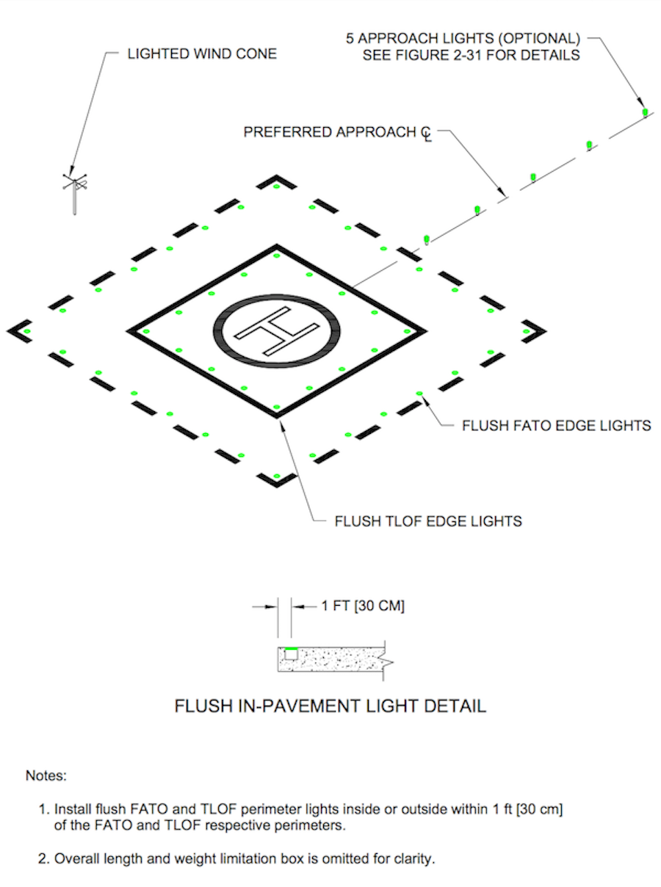
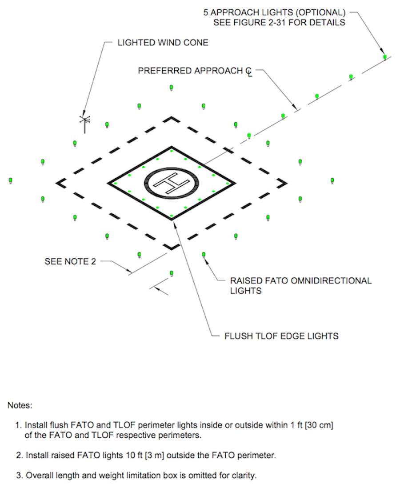
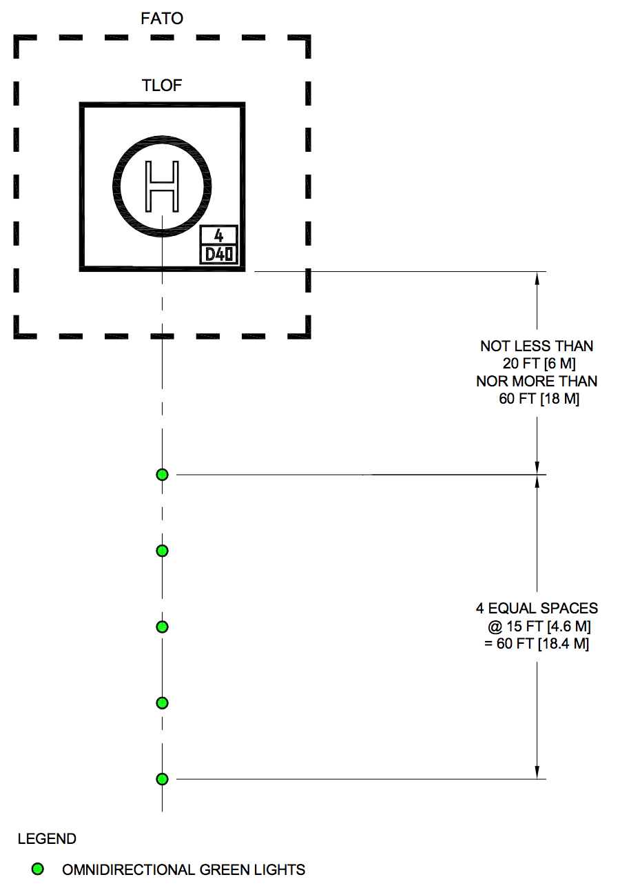
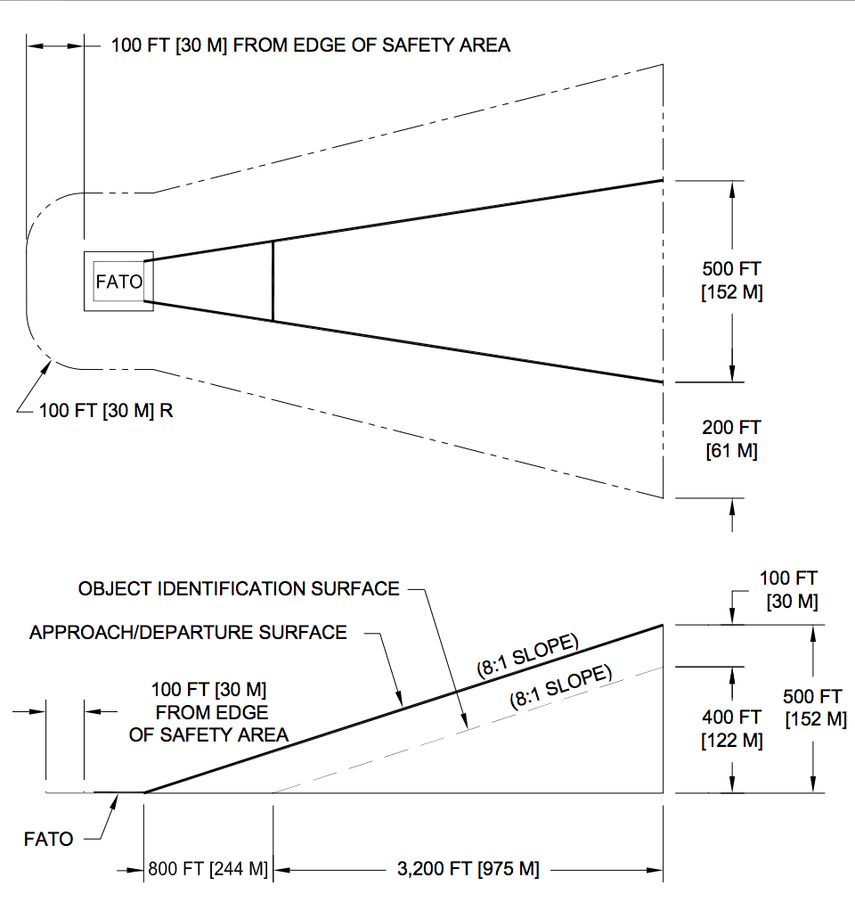
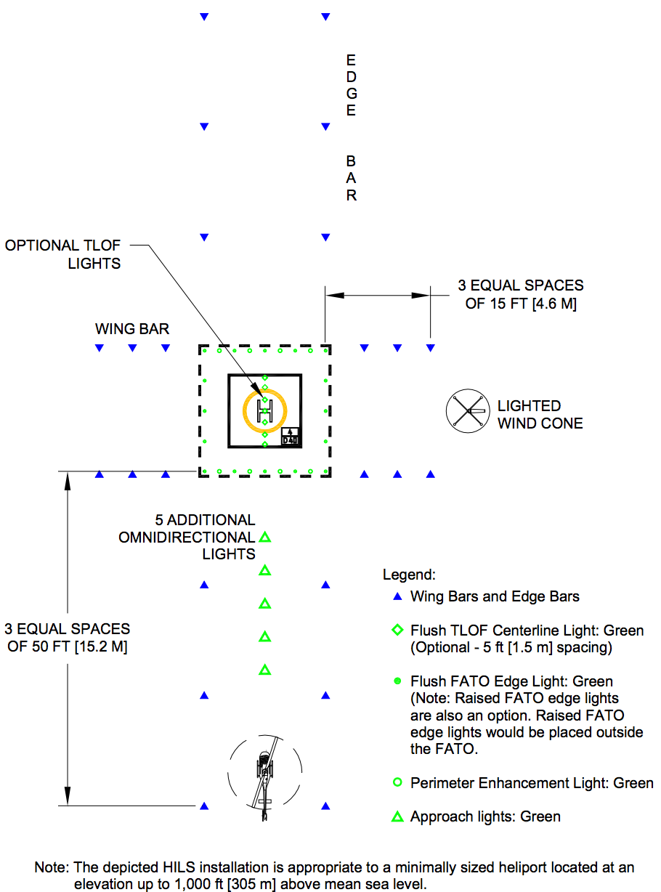

% C4802 Brief Guide
% ENS Eric J. Mott
% March 27, 2017

Curriculum Basis: CNATRAINST 1542.156D

Landing Zone Lighting
=====================

General aviation heliports ([FAA AC 150/5390-2C.216][1]):
- Final approach and takeoff (FATO) zone is marked in raised or flush green
  perimeter lights
- Touchdown and lift off (TLOF) zone is marked in flush green perimeter lights.
- Floodlights may be used  to illuminate the parking area and/or in lieu of
  green perimeter TLOF and FATO lighting.
- Landing direction lights are a line of 5 green lights showing the preferred
  landing direction.
- Heliport beacon flashes white/green/yellow at 30 to 45 flashes/min.
- Lighted wind sock.
- FAA recommends marking objects that penetrate an 8:1 object identification
  surface. ([FAA AC 150/5390-2C.217][1])

### Flush lighting

### Raised lighting

### Landing direction

### Object Identification Surface

Heliport instrument lighting system (HILS):
- The HILS consists of 24 unidirectional white lights that extend the FATO
  perimeter lights.
- The system extends both the right and left edge lights as “edge bars” and both
  the front and rear edge lights as “wing bars,” as shown below:

### HILS

[1]:https://www.faa.gov/documentLibrary/media/Advisory_Circular/150_5390_2c.pdf

Use of lights
=============

RWOP 3.1.2; TH-57 NATOPS 7.7:

- General Operations: POSITION - ON 30 min before sunset until 30 min after
  sunrise. Anti-collision lights on from engine start to shutdown.
- NDZ Ops: Below flight idle: POSITION - FLASH/BRT. In the line: POSITION -
  STDY/BRT, ANTI-COLLISION - OFF. Crossing hold short: ANTI-COLLISION - ON,
  POSITION - STDY/BRT.
- Maintenance required: POSITION - FLASH/BRT.
- Taxiing through pits without refueling: SEARCHLIGHT - FLASH.
- Cleared under rotor arc: LDG LIGHT - FLASH.

CNAF 5.1.1.2:

- Anti-collision lights may be secured at anytime their use adversely affects
  ground operations, or anytime the aircraft is in the clouds.

TH-57 Contact FTI 804:

- During pre-start checks, adjust cockpit lights to their lowest intensity.
- Non-tactical flights > 500 ft, instrument and panel lights may be illuminated.
- Adjust interior lights to their lowest practical level.
- When flying off instruments, adjust lights to higher intensity, but turn them
  back down prior to landing to enhance night vision.

Aircraft Emergencies at Night
=============================

TH-57 Contact FTI 809:

- Same as day except will normally take longer due to increase physiological
  stress and reduced vision.
- Know the location of everything in the cockpit to increase EP efficiency.
- Forced landings: use landing light and any power available to reduce descent
  rate to identify safe landing area.

Landing Site Evaluation at Night
--------------------------------

TH-57 NTAOPS 17.7.2; TH-57 Contact FTI 810:

- Become familiar with the terrain you will be flying over.
- Use landing light to observe obstructions and select landing area.
- SWEEP checks:
  - (S) Size, slope, surface, suitability;
  - (W) Winds, loss of wind effect;
  - (E) Elevation (AGL, PA, DA);
  - (E) Egress route (including waveoff direction);
  - (P) Power (required vs. available).

Night Vision
============

[FAA Airplane Flying Handbook Chapter 12][1]:
- Avoid bright light (especially white).
- Takes at least 30 minutes for eyes to become fully dark adapted.
- Can lose adaptation in a few seconds on exposure to bright light.
- Eyeball anatomy:
  - Cones sense color and are concentrated in the center of the retina (fovea);
  - Rods sense light in black and white and surround the fovea;
  - Cones lose effectiveness under low light, however rods are still effective.
  - When fully adjusted to darkness, rods become 100,000 times more sensitive to
    light then they were under lighted conditions.

[1]: https://www.faa.gov/regulations_policies/handbooks_manuals/aviation/airplane_handbook/media/12_afh_ch10.pdf
